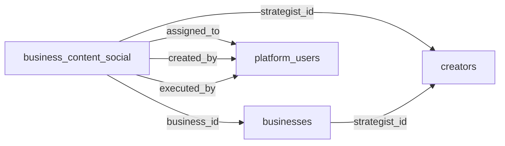

# 📋 Planejamento: Tabela `business_content_social`

## 🎯 Objetivo

Criar uma tabela **SEPARADA** para gerenciar o conteúdo social dos **businesses**, com relacionamento direto ao **business** e ao **estrategista de marketing** responsável.

---

## 🗄️ Estrutura da Nova Tabela

### **Tabela: `business_content_social`**

```sql
CREATE TABLE business_content_social (
  -- Identificação
  id UUID PRIMARY KEY DEFAULT gen_random_uuid(),
  organization_id UUID NOT NULL REFERENCES organizations(id) ON DELETE CASCADE,
  
  -- Relacionamentos PRINCIPAIS
  business_id UUID NOT NULL REFERENCES businesses(id) ON DELETE CASCADE,
  strategist_id UUID REFERENCES creators(id) ON DELETE SET NULL,
  
  -- Informações do Conteúdo
  title VARCHAR(255) NOT NULL,
  description TEXT,
  briefing TEXT,
  
  -- Tipo e Plataformas
  content_type VARCHAR(50) NOT NULL CHECK (content_type IN ('post', 'reels', 'story')),
  platforms TEXT[] NOT NULL DEFAULT '{}',
  
  -- Agendamento
  scheduled_date DATE NOT NULL,
  scheduled_time TIME,
  week_number INTEGER,
  month_number INTEGER,
  year INTEGER,
  
  -- Atribuição e Criação
  assigned_to UUID REFERENCES platform_users(id) ON DELETE SET NULL,
  created_by UUID REFERENCES platform_users(id) ON DELETE SET NULL,
  
  -- Status e Execução
  status VARCHAR(50) NOT NULL DEFAULT 'planned' CHECK (status IN ('planned', 'in_progress', 'completed', 'cancelled')),
  is_executed BOOLEAN DEFAULT false,
  executed_at TIMESTAMP WITH TIME ZONE,
  executed_by UUID REFERENCES platform_users(id) ON DELETE SET NULL,
  
  -- Metadados
  notes TEXT,
  attachments JSONB DEFAULT '[]',
  tags TEXT[] DEFAULT '{}',
  order_index INTEGER DEFAULT 0,
  
  -- Auditoria
  created_at TIMESTAMP WITH TIME ZONE DEFAULT NOW(),
  updated_at TIMESTAMP WITH TIME ZONE DEFAULT NOW(),
  deleted_at TIMESTAMP WITH TIME ZONE,
  
  -- Índices
  CONSTRAINT business_content_social_pkey PRIMARY KEY (id)
);

-- Índices para performance
CREATE INDEX idx_business_content_social_business_id ON business_content_social(business_id);
CREATE INDEX idx_business_content_social_strategist_id ON business_content_social(strategist_id);
CREATE INDEX idx_business_content_social_scheduled_date ON business_content_social(scheduled_date);
CREATE INDEX idx_business_content_social_status ON business_content_social(status);
CREATE INDEX idx_business_content_social_deleted_at ON business_content_social(deleted_at) WHERE deleted_at IS NULL;

-- Trigger para atualizar updated_at
CREATE TRIGGER update_business_content_social_updated_at
  BEFORE UPDATE ON business_content_social
  FOR EACH ROW
  EXECUTE FUNCTION update_updated_at_column();

-- Trigger para calcular week_number, month_number, year
CREATE OR REPLACE FUNCTION set_business_content_date_fields()
RETURNS TRIGGER AS $$
BEGIN
  NEW.week_number := EXTRACT(WEEK FROM NEW.scheduled_date);
  NEW.month_number := EXTRACT(MONTH FROM NEW.scheduled_date);
  NEW.year := EXTRACT(YEAR FROM NEW.scheduled_date);
  RETURN NEW;
END;
$$ LANGUAGE plpgsql;

CREATE TRIGGER set_business_content_date_fields_trigger
  BEFORE INSERT OR UPDATE OF scheduled_date ON business_content_social
  FOR EACH ROW
  EXECUTE FUNCTION set_business_content_date_fields();
```

---

## 🔑 Diferenças da Tabela Antiga

| Campo | `social_content_calendar` | `business_content_social` | Mudança |
|-------|---------------------------|---------------------------|---------|
| **business_id** | ❌ Não existe | ✅ **OBRIGATÓRIO** | **NOVO** - Relacionamento direto |
| **strategist_id** | ❌ Não existe | ✅ Opcional | **NOVO** - Rastrear estrategista |
| **assigned_to** | UUID (users) | UUID (platform_users) | Mudança de referência |
| **created_by** | UUID (users) | UUID (platform_users) | Mudança de referência |
| **executed_by** | UUID (users) | UUID (platform_users) | Mudança de referência |
| **Soft Delete** | ✅ deleted_at | ✅ deleted_at | Mantido |

---

## 🔒 Row Level Security (RLS)

```sql
-- Habilitar RLS
ALTER TABLE business_content_social ENABLE ROW LEVEL SECURITY;

-- Policy 1: Admins e Managers veem tudo
CREATE POLICY "Admins e Managers veem todo conteúdo"
ON business_content_social
FOR SELECT
USING (
  EXISTS (
    SELECT 1 FROM platform_users
    WHERE id = auth.uid()
    AND role IN ('admin', 'manager')
  )
);

-- Policy 2: Business Owners veem apenas conteúdo do seu business
CREATE POLICY "Business Owners veem apenas seu conteúdo"
ON business_content_social
FOR SELECT
USING (
  business_id IN (
    SELECT business_id FROM platform_users
    WHERE id = auth.uid()
    AND role = 'business_owner'
  )
);

-- Policy 3: Strategists veem apenas conteúdo dos businesses que gerenciam
CREATE POLICY "Strategists veem apenas conteúdo dos seus businesses"
ON business_content_social
FOR SELECT
USING (
  business_id IN (
    SELECT id FROM businesses
    WHERE strategist_id IN (
      SELECT creator_id FROM platform_users
      WHERE id = auth.uid()
      AND 'marketing_strategist' = ANY(roles)
    )
  )
);

-- Policy 4: Creators veem apenas conteúdo atribuído a eles
CREATE POLICY "Creators veem apenas conteúdo atribuído"
ON business_content_social
FOR SELECT
USING (
  assigned_to = auth.uid()
  AND 'creator' = ANY(
    SELECT unnest(roles) FROM platform_users WHERE id = auth.uid()
  )
);

-- Policy 5: INSERT - Apenas admins, managers, business_owners e strategists
CREATE POLICY "Apenas admins, managers, business_owners e strategists podem criar"
ON business_content_social
FOR INSERT
WITH CHECK (
  EXISTS (
    SELECT 1 FROM platform_users
    WHERE id = auth.uid()
    AND (
      role IN ('admin', 'manager', 'business_owner')
      OR 'marketing_strategist' = ANY(roles)
    )
  )
);

-- Policy 6: UPDATE - Apenas admins, managers, business_owners e strategists
CREATE POLICY "Apenas admins, managers, business_owners e strategists podem atualizar"
ON business_content_social
FOR UPDATE
USING (
  EXISTS (
    SELECT 1 FROM platform_users
    WHERE id = auth.uid()
    AND (
      role IN ('admin', 'manager', 'business_owner')
      OR 'marketing_strategist' = ANY(roles)
    )
  )
);

-- Policy 7: DELETE - Apenas admins e managers (soft delete)
CREATE POLICY "Apenas admins e managers podem deletar"
ON business_content_social
FOR UPDATE
USING (
  EXISTS (
    SELECT 1 FROM platform_users
    WHERE id = auth.uid()
    AND role IN ('admin', 'manager')
  )
)
WITH CHECK (deleted_at IS NOT NULL);
```

---

## 📊 Relacionamentos



### **Fluxo de Dados:**

1. **Business** cria conta → `businesses` table
2. **Strategist** é atribuído ao business → `businesses.strategist_id`
3. **Strategist** cria conteúdo → `business_content_social`:
   - `business_id` = ID do business
   - `strategist_id` = ID do strategist (creator)
   - `created_by` = ID do platform_user (strategist)
4. **Conteúdo** é atribuído a um creator → `assigned_to`
5. **Creator** executa conteúdo → `is_executed = true`, `executed_by`

---

## 🔄 Migração de Dados

### **Opção 1: Não Migrar (Recomendado)**

- Manter `social_content_calendar` para dados históricos do CRM interno
- Começar `business_content_social` do zero para businesses
- **Vantagem:** Separação clara, sem risco de corromper dados antigos
- **Desvantagem:** Dados históricos não aparecem para businesses

### **Opção 2: Migrar Dados Selecionados**

```sql
-- Migrar apenas conteúdos que podem ser associados a um business
INSERT INTO business_content_social (
  organization_id,
  business_id,
  strategist_id,
  title,
  description,
  briefing,
  content_type,
  platforms,
  scheduled_date,
  scheduled_time,
  week_number,
  month_number,
  year,
  assigned_to,
  created_by,
  status,
  is_executed,
  executed_at,
  executed_by,
  notes,
  attachments,
  tags,
  order_index,
  created_at,
  updated_at,
  deleted_at
)
SELECT
  scc.organization_id,
  -- TODO: Definir lógica para associar a um business
  '00000000-0000-0000-0000-000000000000'::UUID AS business_id,
  NULL AS strategist_id,
  scc.title,
  scc.description,
  scc.briefing,
  scc.content_type,
  scc.platforms,
  scc.scheduled_date,
  scc.scheduled_time,
  scc.week_number,
  scc.month_number,
  scc.year,
  -- TODO: Mapear users para platform_users
  NULL AS assigned_to,
  NULL AS created_by,
  scc.status,
  scc.is_executed,
  scc.executed_at,
  NULL AS executed_by,
  scc.notes,
  scc.attachments,
  scc.tags,
  scc.order_index,
  scc.created_at,
  scc.updated_at,
  scc.deleted_at
FROM social_content_calendar scc
WHERE scc.deleted_at IS NULL;
```

---

## 🚀 Implementação

### **Fase 1: Criar Tabela e RLS** ✅
- [ ] Criar migration para `business_content_social`
- [ ] Criar índices
- [ ] Criar triggers
- [ ] Implementar RLS policies
- [ ] Testar policies

### **Fase 2: Atualizar API** ✅
- [ ] Criar `/api/business-content` (nova API)
- [ ] GET: Listar conteúdos (filtrar por business_id)
- [ ] POST: Criar conteúdo (validar business_id e strategist_id)
- [ ] PUT/PATCH: Atualizar conteúdo
- [ ] DELETE: Soft delete
- [ ] Validar permissões em cada endpoint

### **Fase 3: Atualizar Frontend** ✅
- [ ] Atualizar `StrategistContentView` para usar nova API
- [ ] Atualizar `ContentModal` para incluir business_id
- [ ] Criar página para Business Owners (`/conteudo`)
- [ ] Testar fluxo completo

### **Fase 4: Migração (Opcional)** ⏸️
- [ ] Decidir se migra dados antigos
- [ ] Criar script de migração
- [ ] Executar migração em staging
- [ ] Validar dados migrados
- [ ] Executar em produção

---

## 📝 Exemplo de Uso

### **1. Strategist cria conteúdo para Boussolé:**

```typescript
const response = await fetch('/api/business-content', {
  method: 'POST',
  headers: { 'Content-Type': 'application/json' },
  body: JSON.stringify({
    business_id: 'abc123...', // ID do Boussolé
    strategist_id: '548f643b...', // ID da Pietra
    title: 'Post - Instagram',
    content_type: 'post',
    platforms: ['instagram'],
    scheduled_date: '2025-10-20',
    scheduled_time: '18:00',
    status: 'planned'
  })
});
```

### **2. Query para listar conteúdo do Boussolé:**

```sql
SELECT * FROM business_content_social
WHERE business_id = 'abc123...'
AND deleted_at IS NULL
ORDER BY scheduled_date DESC;
```

---

## ✅ Checklist de Implementação

- [ ] Criar migration `business_content_social`
- [ ] Criar RLS policies
- [ ] Criar API `/api/business-content`
- [ ] Atualizar `StrategistContentView`
- [ ] Atualizar `ContentModal`
- [ ] Testar com Pietra (strategist do Boussolé)
- [ ] Documentar API
- [ ] Criar testes automatizados

---

**Status:** 📋 Planejamento Completo  
**Próximo Passo:** Criar migration  
**Responsável:** Luiz Vincenzi

